## 1.1  今日目标

1. 掌握互联网的工作原理
2. 掌握域名、DNS和IP地址之间的关系
3. 理解hosts文件在互联网访问过程中的作用
4. 理解静态网站和动态网站的区别
5. 理解动态网站的服务器组成
6. 了解PHP的工作过程
7. 掌握PHP变量的使用方式
8. 理解可变变量的概念
9. 掌握可变变量的访问形式
10. 理解变量的值传递和引用传递的区别


## 1.2  PHP简介

#### 1.2.1 概述

 PHP是Hypertext Preprocessor的缩写，（超文本预处理器）是一种在服务器端运行的开源的脚本语言。

LAMP组合(Linux,Apache,MySQL,PHP)，这四个产品都是公开源代码的产品

 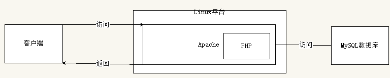

```
php是一门语言，用来做业务逻辑
apache为PHP提供了运行环境
linux为Apache的运行提供了平台
mysql数据库用来存储数据
```

多学一招：什么是wamp组合

```
windows+apche+mysql+php
```


#### 1.2.2  五个基本概念

1、静态页面和动态页面

```
静态页面：服务器不执行的页面
动态页面：服务器执行的页面
```

问题：动态网站中是否可以存放静态页面

答：可以


2、客户端和服务器端

```
浏览者这段是客户端
服务器端：给浏览者提供服务
```

 


3、端口和端口号        端口号的范围： 0-65535

 


4、BS架构和CS架构

BS：通过浏览器去访问服务器

```
b:browser（浏览器）
s:sever(服务器)
优点：
1、只要有浏览器就可以访问
2、开发低
缺点：
2、开发的代码都放在服务器上    胖服务器-瘦客户端
```

所有的web都是BS架构的

CS：通过客户端软件去访问服务器

```
c:client（客户端）
s:server(服务器)
优点：
1、可以开发客户端和服务器端，这时候就可以实现负载的均衡
缺点：
1、必须要安装一个软件才能去访问
2、开发成本高
```

例如：QQ、炒股软件


5、前台和后台

```
前台：浏览器看到的界面
后台：管理员看到的界面
```


#### 1.2.3  PHP的优点

1. 跨平台，既能在windows上运行，也能在linux上运行
2. 源码开放：不会涉及到版权问题
3. 语法简单：PHP入门简单
4. 运行在服务器端，只要在服务器部署环境就可以了。


## 1.3  Web介绍

#### 1.3.1  web时代的变迁


从互联网开始崛起到现在，经历了从web1.0、2.0到web3.0的过程

```
Web1.0（信息共享）的主要特点在于用户单纯的获取信息
Web2.0（信息共建）更注重用户的交互作用，用户既是网站内容的浏览者，也是网站内容的制造者。
Web3.0（信息传承）通过第三方信息平台对多家网站的信息进行整合，用户在互联网上拥有自己的数据，并能在不同网站上使用
```

举例：

```
Web1.0：来到一个餐馆，老板给你上了一盘番茄炒蛋；
Web2.0：来到一个餐馆，你跟老板主动点了一份番茄炒蛋；
Web3.0：来到一个餐馆，老板见到你就问，老规矩，还要番茄炒蛋？
```


#### 1.3.2  Web服务原理

静态网站原理（浏览器-服务器）

动态网站原理（浏览器-服务器-数据库）

智能网站原理（浏览器-服务器【分析推荐】-数据库）


## 1.4  搭建Web服务器

#### 1.4.1  安装phpstudy

直接解压即可

 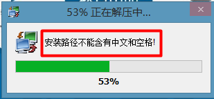


#### 1.4.2  目录结构

 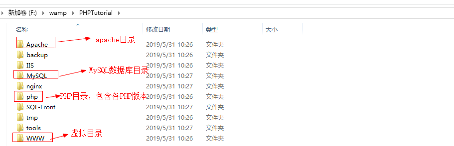

启动服务

 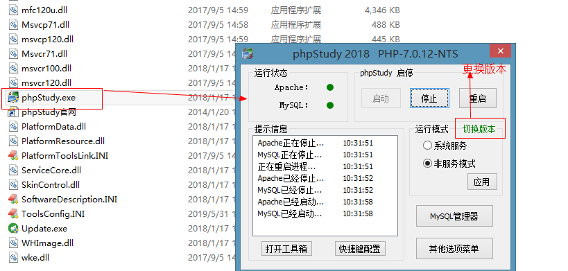


#### 1.4.3  访问服务器

在www目录下创建demo.php页面

```php
<?php
   phpinfo();
```

访问服务器

```
访问规则：http://服务器ip地址/php页面
比如：
http://localhost/demo.php
http://127.0.0.1/demo.php
```

 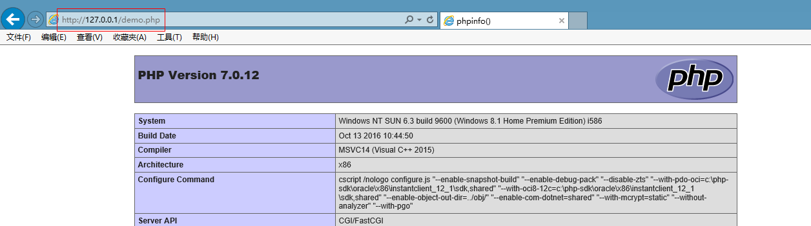


#### 1.4.4  常用的命令

补充DOS命令

```
切换盘符	盘符+冒号
进入目录	cd 目录地址
```

Apache的命令

```
httpd -v   查看apache版本号   version
httpd -t   检测运行环境  test
```

  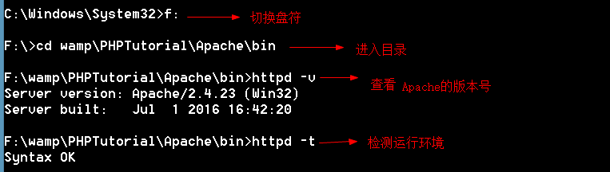


PHP的命令

```
php -v  PHP版本号
```

 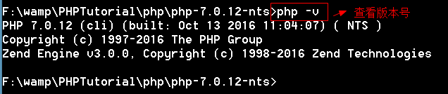


#### 1.4.5  互联网通讯原理

本质一台电脑访问另外一台电脑资源、寻址过程（IP地址、端口、域名、DNS）

在互联网上，IP地址是用来区分每台计算机的标识，但是IP记忆不友好，我们将IP地址取一个名字，一个IP对应一个名字，这个名字就称为域名。

访问过程：

 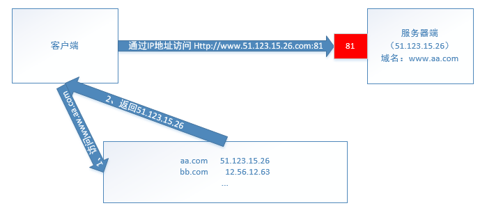

 步骤：

1、客户端输入域名（网址），在最近的机房做DNS解析（Domain Name Server）,DNS解析就是将域名转化成IP地址

2、通过IP地址访问服务器


#### 1.4.6  DNS解析

目标：ip地址访问服务器不方便，通过域名来访问。

 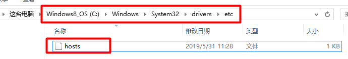

hosts文件

 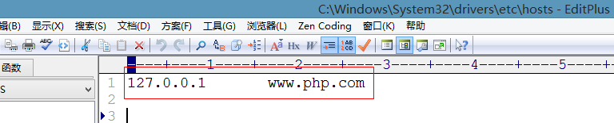

测试

 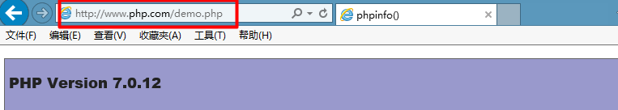

小结：

hosts文件用来做DNS解析


## 1.5  服务器配置

#### 1.5.1  虚拟目录配置

**1、更改虚拟目录**

要更改虚拟目录的位置，需要到apache的配置文件中更改（conf/httpd.conf)

在phpstudy中，httpd.conf和vhost.conf都有配置虚拟目录的指令，并且两个配置文件中都有配置虚拟目录的指令，为了测试，我们注释掉vhost.conf的引入

 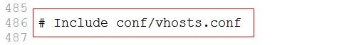

更改虚拟目录

 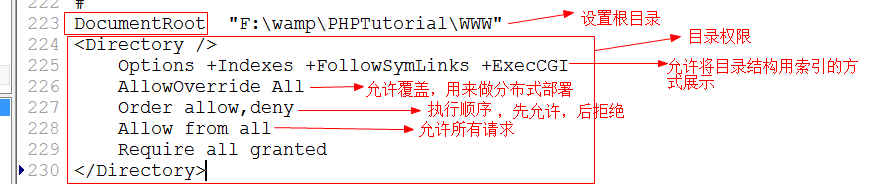


提醒：项目上线以后，不可以显示目录结构


权限的练习

例题一：

```
Order allow,deny
Allow from all
# 允许所有请求访问
```

例题二：

```
Order allow,deny
Allow from all
Deny from all
# 拒绝所有请求访问
```

练习三：

```
Order allow,deny
Deny from all
Allow from all
#  拒绝所有请求访问
```

练习四：

```
<Directory "C:/PHP/Apache/htdocs">
   Order deny, allow
   Allow from 192.168.101.50
   Deny from 192.168
</Directory>
# 拒绝192.168开头，但除去（192.168.101.50）的IP的访问
```

练习五：

```
<Directory "C:/PHP/Apache/htdocs">
    Order deny, allow
    Allow from 192.168.101.50
   Deny from all
</Directory>
# 只允许192.168.101.50访问
```

练习六：

```
<Directory "C:/PHP/Apache/htdocs">
   Order allow,deny
   Allow from 192.168
   Deny from 192.168.101.50
</Directory>
# 只允许192.168开头的，但要去除192.168.101.50 的IP访问
```


**2、更改默认首页**

在httpd.conf配置文件中

 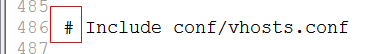

默认首页的查找顺序，从前往后。


**3、更改监听端口**

在httpd.conf配置文件中设置

通过Listen指令设置监听的端口

可以设置多个监听端口

 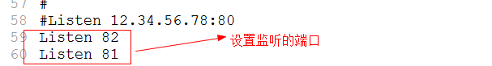

访问：

http://域名:端口号/demo.php

 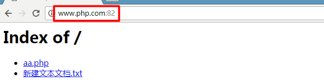


补充：查看端口的占用情况

在命令行下使用 netstat -ano查看

  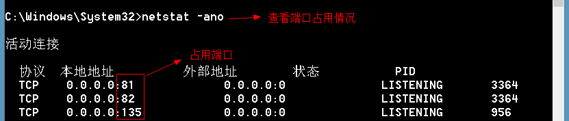

在结果中查找字符串

 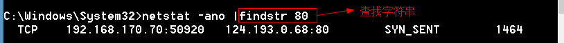


#### 1.5.3  虚拟主机配置

需求：

```
输入www.baidu.com	打开web1的网站
输入www.sina.com打开web2的网站
```

配置过程：

 要配置虚拟主机，需要在httpd.conf中引入虚拟主机的培训文件（vhosts.conf）

 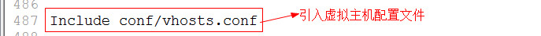

vhosts.conf配置如下

```
<VirtualHost _default_:80>
  DocumentRoot "C:\web1"       #指定虚拟目录路径
  ServerName www.baidu.com     # 虚拟目录绑定的域名
  DirectoryIndex aa.php        # 默认首页
  <Directory "C:\web1">
    Options -Indexes -FollowSymLinks +ExecCGI
    AllowOverride All
    Order allow,deny
    Allow from all
    Require all granted
  </Directory>
</VirtualHost>


<VirtualHost _default_:80>
DocumentRoot "C:\web2"
 ServerName www.sina.com
 DirectoryIndex bb.php
  <Directory "C:\web2">
    Options -Indexes -FollowSymLinks +ExecCGI
    AllowOverride All
    Order allow,deny
    Allow from all
    Require all granted
  </Directory>
</VirtualHost>
```

在host文件中做dns解析

 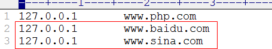

访问结果

  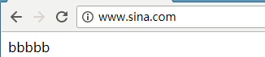

 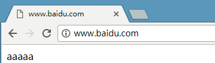


补充：站点、虚拟目录、虚拟主机的区别

站点：站点就是一个文件夹，用来保存与网站有关的所有素材

虚拟目录：站点+权限

虚拟主机：虚拟目录+域名


## 1.6  PHP语法入门

#### 1.6.1  PHP是编译型语言

编译语言和解释语言的区别在于是否保存最终的可执行程序。

 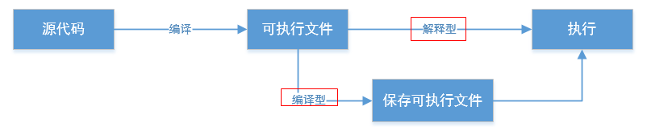

PHP执行过程 


#### 1.6.2 PHP定界符

因为PHP是脚本语言，所以需要定界符

1、标准风格（推荐使用）

```
<?php

?>
```

例题

```php
<?php
	echo 'i am a boy!';
?>
```

提醒，如果整个页面都是PHP代码，PHP结束符是可以省略的（推荐）

```php
<?php
	echo 'i am a boy!';
```


2、短标记风格（默认情况下不支持，需要在php配置文件中开启支持段标记）

 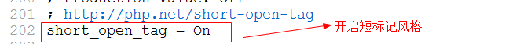

```
<?
?>
```

例题：

```php
<?
	echo '锄禾日当午';
?>
```

小结：

httpd.conf是apache的配置文件

php.ini是php的配置文件


#### 1.6.3  注释

单行注释： //和# 

多行注释：  /*    */

 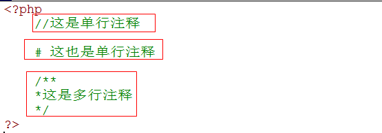


#### 1.6.4 PHP输出语句

```
echo:输出
print:输出，输出成功返回1
print_r()：输出数组
var_dump():输出数据的详细信息，带有数据类型和数据长度

<?php
	var_dump('abc');	//string(3) "abc" 
?>
```


## 1.7  变量

变量的本质就是内存中的一段空间

#### 1.7.1  变量的命名规则

1.  变量必须以$开头，$符不是变量的一部分，仅表示后面的标识符是变量名。
2.  除了$以外，以字母、下划线开头，后面跟着数字、字母、下划线
3.  变量名区分大小写，$aa和$Aa是两个空间

下列变量是否合法

```
$a		合法
$a1		合法
$1a		不合法
$_1a	合法
```

注意：PHP语句必须以分号结尾

```php
<?php
	$a=10;
	$name='Tom';
?>
```

#### 1.7.2  可变变量

变量名可以变，将变量名存储在另外一个变量中

例题

```php
<?php
$a=10;
$b='a';
echo $$b;	//10
```

例题

```php
<?php
	$name1='tom';
	$name2='berry';
	if(rand(1,10)%2){ 
		$name='name1';	//将变量名存储在$name中
	}else{
		$name='name2';
	}
	echo $$name;   
```

小结：

1、rand(1,10)：获取1-10的随机整数


#### 1.7.3  变量传递

变量的传递有值传递和地址传递（引用传递）

```php
<?php
//值传递
$num1=10;	//将10付给$num1
$num2=$num1;	//将$num1的值付给$num2
$num2=20;		//更改$num2
echo $num1;		//10
```

 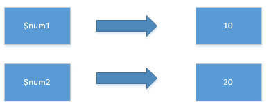

```php
//地址传递
$num1=10;		//将10付给$num1
$num2=&$num1;	//将$num1的地址付给$num2
$num2=20;		//更改$num2
echo $num1;		//20
```

 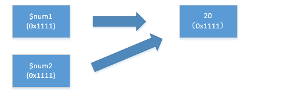

小结:

1、参数的传递有两种，值传递和地址传递

2、&表示获取变量的地址

3、值传递中，一个变量变了，另一个变量没有影响，因为是两个空间

4、地址传递中，一个变量变了，另一个也变了，因为两个变量指向同一个空间


#### 1.7.4  销毁变量

用unset()来销毁变量，销毁的是变量名，变量值由PHP垃圾回收机制销毁

```php
<?php
$num1=10;
$num2=&$num1;
unset($num1);	//销毁的是变量名
echo $num2;		//10
```

没有变量引用的值是垃圾。


## 1.8  作业

phpstudy安装完毕后，有一个phpmyadmin的管理数据库软件，默认情况下，放在虚拟目录下，这样不合理，请重新配置虚拟主机访问phpmyadmin

输入`phpmyadmin.com`打开phpmyadmin管理软件


